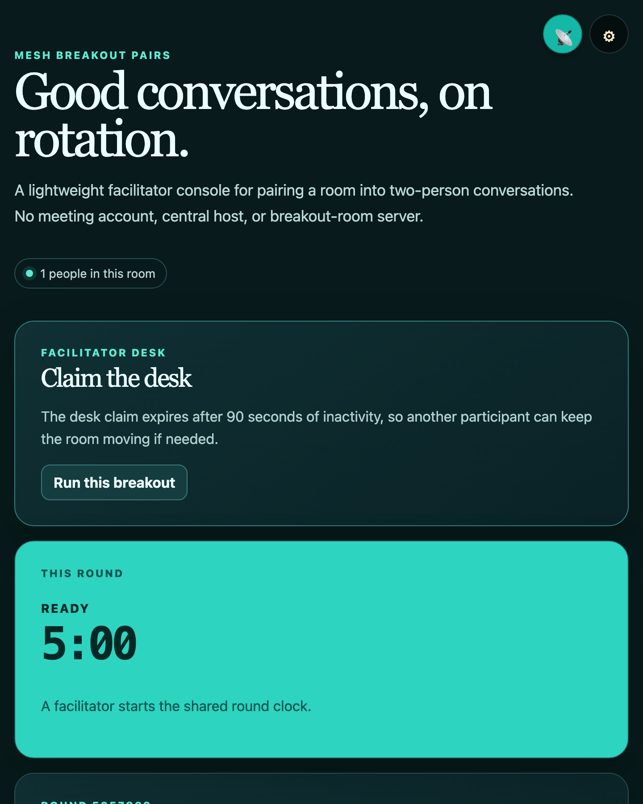
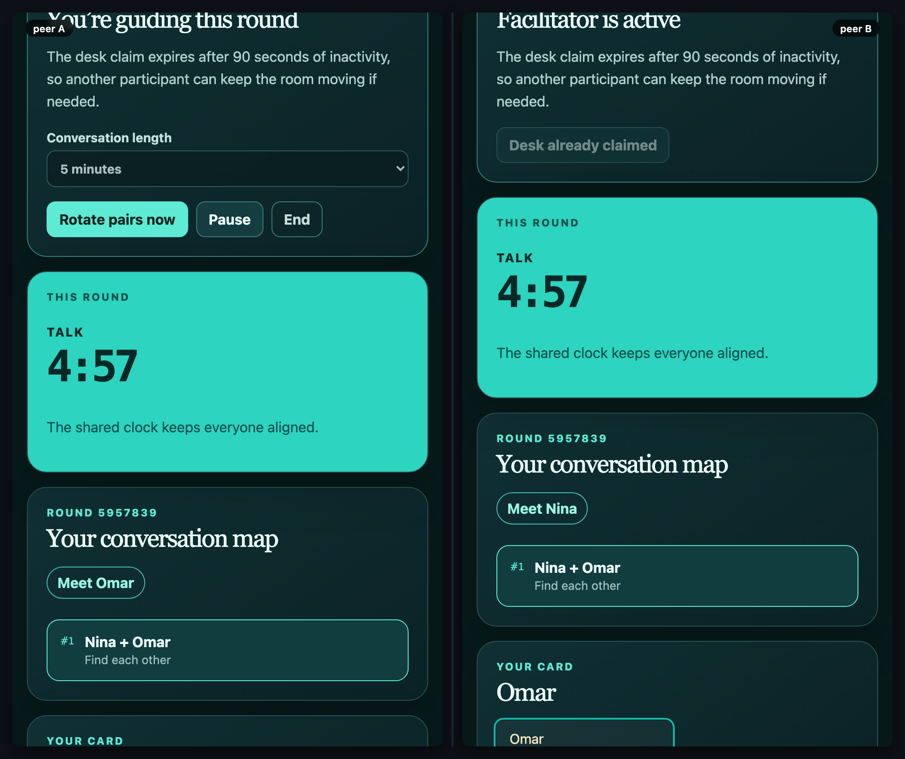

# mesh-breakout-pairs

[](https://baditaflorin.github.io/mesh-breakout-pairs/)
[](https://github.com/baditaflorin/mesh-breakout-pairs/blob/main/package.json)
[](./LICENSE)

> Facilitator-led peer breakout rotations for small group conversations.

**Live → https://baditaflorin.github.io/mesh-breakout-pairs/**

**Source → https://github.com/baditaflorin/mesh-breakout-pairs**

**Tip the dev (buy a coffee) → https://www.paypal.com/paypalme/florinbadita**

---



> Two peers, side-by-side, in the same room. Drop a `tests/demo/scenario.mjs`
> exporting `default async (a, b) => …` and run `npm run demo` to regenerate
> `docs/preview.png` plus `docs/demo-a.webm` / `docs/demo-b.webm` clips.



## What it does

`mesh-breakout-pairs` turns one shared room into a lightweight facilitator desk: claim the desk, choose a conversation length, start a shared clock, and rotate fair two-person pairings when the round ends. It is designed for workshops, classes, standups, and dinner-table conversations where formal video-conference breakout rooms are overkill.

Pairings are derived locally from the shared roster and mesh-common's fair room randomness. The timer stores only lifecycle timestamps, so all peers see the same countdown without per-second network writes.

## Use it

1. Share the room with the invite QR or link.
2. Everyone adds a display name.
3. One participant selects **Run this breakout**, chooses a duration, and starts the round.
4. Follow the highlighted pairing, then the facilitator selects **Rotate pairs now** for the next conversation.

The facilitator desk is an expiring coordination claim, not an authorization boundary. Anyone in the room can inspect the shared state.

Read the principles → **https://baditaflorin.github.io/rootless-computing/principles.html**

## Quickstart

Open the live URL on two devices in the same room (set in ⚙ settings, or scan the room QR). Everything else is in-app.

For local hacking:

```bash
git clone https://github.com/baditaflorin/mesh-common
git clone https://github.com/baditaflorin/mesh-breakout-pairs
cd mesh-breakout-pairs
npm install
npm run dev
```

`mesh-common` must sit as a **sibling** directory because `package.json` references it via `file:../mesh-common`.

## Self-hosted infrastructure

| Repo                                              | Endpoint                               | Purpose                     |
| ------------------------------------------------- | -------------------------------------- | --------------------------- |
| https://github.com/baditaflorin/signaling-server  | `wss://turn.0docker.com/ws`            | y-webrtc signaling fan-out  |
| https://github.com/baditaflorin/turn-token-server | `https://turn.0docker.com/credentials` | HMAC TURN creds, 1-hour TTL |
| https://github.com/baditaflorin/coturn-hetzner    | `turn:turn.0docker.com:3479`           | TURN relay                  |

## Settings overrides

The settings drawer lets the user override signaling and TURN endpoints. localStorage keys:

- `mesh-breakout-pairs:signalingUrl`
- `mesh-breakout-pairs:turnTokenUrl`
- `mesh-breakout-pairs:iceServers`
- `mesh-breakout-pairs:room`

If endpoints are blank or unreachable, the app falls back to STUN-only.

## Version + commit on every screen

The bottom-right footer on every screen of the live app shows:

- `source` → this repo
- `tip ♥` → PayPal
- `vX.Y.Z · <short-sha>` — version from `package.json` plus the build-time git commit

## Build & deploy

GitHub Pages serves the committed `docs/` directory on the `main` branch. There is no GitHub Actions build workflow; root `.woodpecker.yml` validates formatting, TypeScript, tests, and the Pages build.

```bash
npm run smoke                                    # build + sanity-check docs/
bash ../mesh-common/scripts/screenshot-app.sh    # regenerate docs/screenshot.png
```

## Privacy

<!-- mesh:privacy-section:start -->

Everything you publish to a room is visible to every peer in that room. Your local device's name, key, and choices stay local. Cryptographic signatures prove **who** wrote each entry; they do **not** prevent peers from reading or copying entries. The room URL is the access control — share it deliberately.

See `docs/privacy.md` for the full threat model — capabilities used, what other peers in the mesh see, what the self-hosted infra sees, what stays local.
<!-- mesh:privacy-section:end -->

## License

MIT — see `LICENSE`.
